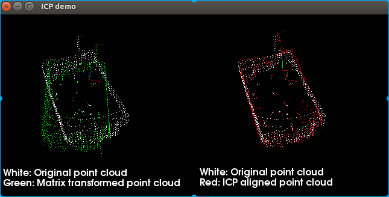

# PCL-ICP-NDT
This is sample lidar ICP/NDT code by using PCL 1.7

## Files
- `pcl_icp.cpp` `pcl_ndt.cpp` Basic icp/ndt method with sample/filter...(oprional)
- `pcl_icp/ndt_continue.cpp`  Test for fun 
- `/data` The dataset includes room  and corridor pointclouds
- `/result` Some results pics

## useage
```
cd build
./xxx
```
### sample
```
$ ./pcl_icp
Loaded 28221 data points from 0.pcd
Loaded 28096 data points from 1.pcd
    0.967414    -0.253206 -0.000820591    -0.375758
    0.250679     0.958204    -0.137871     0.658629
   0.0356958     0.133172     0.990451     0.305597
           0            0            0            1
fitness: 0.156613
```


